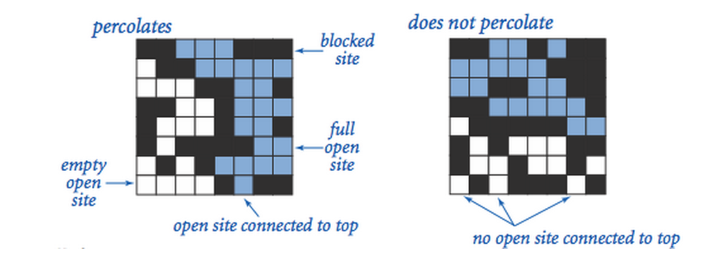

## Coursera - Algorithms Part I
### Week 1 - Interview Questions - Union Find
#### Question 1: Social network connectivity

Given a social network containing N members and a log file containing M timestamps at which times pairs of members formed friendships, design an algorithm to determine the earliest time at which all members are connected (i.e., every member is a friend of a friend of a friend ... of a friend). Assume that the log file is sorted by timestamp and that friendship is an equivalence relation. The running time of your algorithm should be MlogN or better and use extra space proportional to N.

The Percolation Model: We model a percolation system using an N-by-N grid of sites. Each site is either open or blocked. A full site is an open site that can be connected to an open site in the top row via a chain of neighboring (left, right, up, down) open sites. We say the system percolates if there is a full site in the bottom row. In other words, a system percolates if we fill all open sites connected to the top row and that process fills some open site on the bottom row.
 

## Referências
- https://stackoverflow.com/questions/50232557/visual-studio-code-java-extension-howto-add-jar-to-classpath
- https://blog.usejournal.com/visual-studio-code-for-java-the-ultimate-guide-2019-8de7d2b59902
- http://seanzhou1023.blogspot.com/2017/04/quiz-1-princeton-algorithm.html
- https://vancexu.github.io/2015/07/21/intro-to-union-find-data-structure-exercise.html
- https://github.com/vancexu/Algs4/blob/master/JobInterviewQuestions/1.1_union_find/WeightedQuickUnionUF.java
- https://stackoverflow.com/questions/25799520/union-find-expressed-as-a-social-network
- https://github.com/eschwabe/interview-practice/blob/master/coursera/algorithms-part1/union-find/SocialNetworkConnectivity.java
- https://github.com/tiffaniechia/Algorithms-Percolation
- 

### GIT
- git remote add origin https://github.com/HandBoy/UnionFind-Social-Network-Connectivity.git
- git push -u origin master